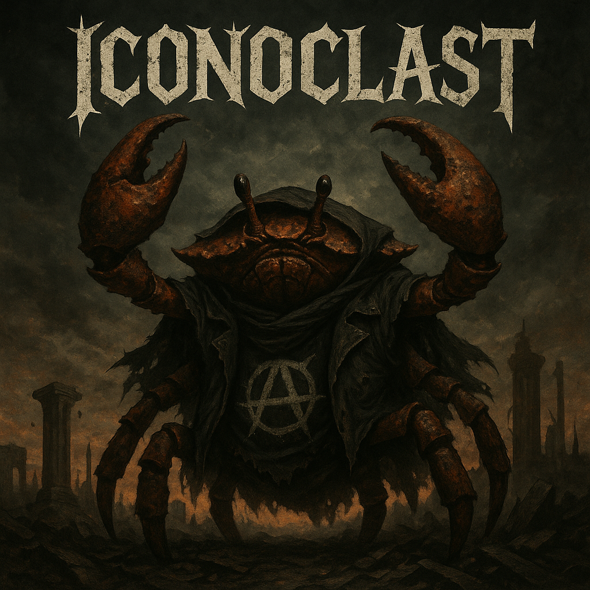

# Iconoclast

Project iconoclast's aim is to significantly simplify the setup of Rust business applications.

This project is a little more than a template (but much less than a full-stack framework). It started as a project-template, but now also includes a crate for reusable code.

It provides:

- a ready-to-use/copy project/[skeleton](./skeleton) for a rust application with [hexagonal architecture](https://en.wikipedia.org/wiki/Hexagonal_architecture_(software))
- [hexagonal TODO app](./examples/hexagonal) as a full example for a hexagonal rust service
- [layered TODO app](./examples/layered) based on a traditional layered architecture
- [simple TODO](./examples/simple) not enforcing a strict architecture, so maybe a better fit for small apps or e.g. CRUD apps
- crate
  *[iconoclast](https://crates.io/crates/iconoclast)* to reduce the amount of code required to copy-paste

## Features/Design

- hexagonal- or traditional layered-architecture
- testable (via [mockall](https://crates.io/crates/mockall) or [faux](https://crates.io/crates/faux))
- manual dependency-injection
- configuration via TOML-file and environment-variables (based on [config](https://docs.rs/config/latest/config/))
- "structured" (json) [logging/tracing](https://tracing.rs)
- [axum](https://github.com/tokio-rs/axum) for http
- [HTML templating with askama](https://askama.readthedocs.io) (a jinja-like templating) with
  [live-reload](https://github.com/leotaku/tower-livereload)
- separate "management" service for [health-check](https://kubernetes.io/docs/tasks/configure-pod-container/configure-liveness-readiness-startup-probes/), metrics (TODO) etc.
- [kafka](https://github.com/fede1024/rust-rdkafka)
- persistence via [sqlx](https://github.com/launchbadge/sqlx) and [PostgresQL](https://www.postgresql.org/)

## Getting started

- copy over the `examples/skeleton` folder

## Usage

See [the skeleton's README](./skeleton/README.md) for actual usage.

# The name

*iconoclast* (aɪˈkɒnəˌklæst) —

> a person who attacks established or traditional concepts, principles, laws, etc

Iconoclast is here to

- question the dominance of Java/Spring
- show Rust is also an application programming language

Also, it's the name of
an [album](https://en.wikipedia.org/wiki/Iconoclast_(Part_1:_The_Final_Resistance)).

# License

Licensed under either of

* Apache License, Version 2.0
  ([LICENSE-APACHE](LICENSE-APACHE) or http://www.apache.org/licenses/LICENSE-2.0)
* MIT license
  ([LICENSE-MIT](LICENSE-MIT) or http://opensource.org/licenses/MIT)

at your option.

## Contribution

Unless you explicitly state otherwise, any contribution intentionally submitted
for inclusion in the work by you, as defined in the Apache-2.0 license, shall be
dual licensed as above, without any additional terms or conditions.